# アノテーションツール

他の分野と比べると、音楽データに関するアノテーションは以下のような特徴があります。
* メロディー・コード・キー・リズム・歌詞・楽器編成など、複数の要素が混在するため、アノテーションのフォーマットも多種多様である
* 拍や音符など、時間情報の精度が求められる場合が多い

同じく音を扱う**音声認識**分野では、多数の便利なアノテーションツールが存在しており、タスクによっては音楽アノテーションでも活用できるかもしれません。しかしいざやってみると、ちょっと痒い所に手が届いてない部分もあります。たとえば、
* ラベルのタイミング情報をビートグリッドにスナップさせたい
* 繰り返しが多いので、いちいち入力せずコピペで時短したい
* （拍・音符・コードなど）ラベルの正確さを音で確認したい

こういった要件を満たすツールは案外見つけにくいです。

故に音楽データのアノテーションには特殊なツールが必要になる場合があります。本ページでは音楽データのアノテーションに利用できるツールを紹介します。

# Audacity

https://www.audacityteam.org/

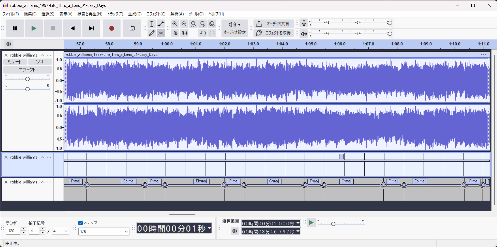

定番のフリー音編集ツールです。

アノテーションツールとしては単純で、区間ラベルのみ対応しています。選択した区間にラベルを付与し、テキストデータに出力することができます。

VAMPプラグインをサポートしており、音楽解析プラグインを用いて仮ラベルを作ったり、ラベル作成用のビートグリッドを作成することができます。ビートグリッドのラベルがあれば、ほかのラベルを編集する際、ビートグリッドにスナップさせることができます。

# Sonic Visualiser

https://www.sonicvisualiser.org/

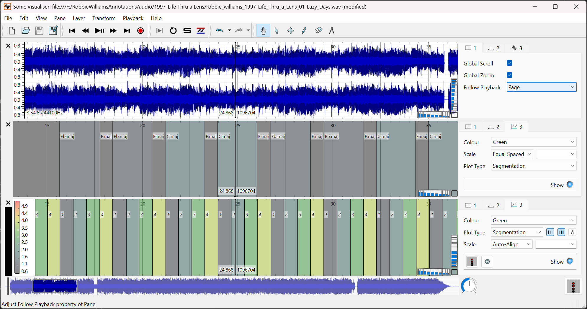

Queen Mary University of London (QMUL)の音楽研究グループが開発したツールです。その名の通り、音声の特徴量や音声ラベル可視化の定番ツールです。Audacityよりも見やすい高度な可視化機能が備わっており、様々な形式のアノテーションを表示することができます。

境界線のタイミングでクリック音を鳴らす機能もあり、ラベルと原曲のタイミング確認に便利です。

こちらもVAMPプラグインをサポートしており、音楽解析プラグインを利用できます。

# Tony

https://www.sonicvisualiser.org/tony/index.html

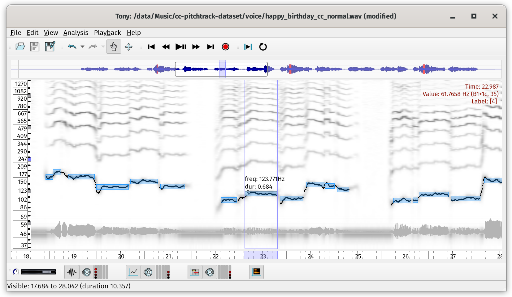

同じくQMULが開発した、**ソロボーカルの音高アノテーション**に特化したツールです。

基本周波数を自動解析し、ノートレベルの情報に自動変換します。ユーザーはノートの音高や分割を修正することで、正しい音高アノテーションを作ることができます。

# wavesurfer.js / peaks.js

https://waveform.prototyping.bbc.co.uk/

https://wavesurfer.xyz/

そのまま使えるツールではなく、ブラウザベースのアノテーションツールを作るためのJSコンポーネントです。自作するのがなかなか難しいオーディオプレイヤー機能や、アノテーションを付けるための機能が備わっています。

wavesurfer.jsは主にオーディオプレイヤーとして開発されており、[プラグイン](https://wavesurfer.xyz/examples/?regions.js)を用いてアノテーション表示・編集する機能を実現することができます。

スペクトログラムを表示するプラグインもあり、拡張性は高いです。

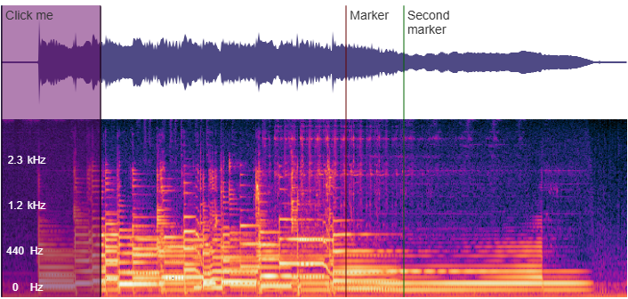

peaks.jsは最初からアノテーションツールとして開発されており、セグメントやマーカーを追加する機能が備わっています。

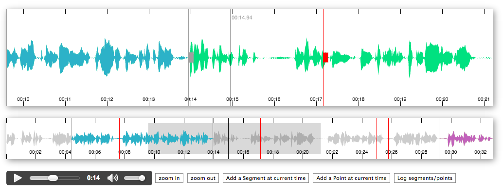

理想のアノテーションツールが見つからなければ、自分で作ってしまうのも手かもしれません。実際に、wavesurfer.jsを基に開発されたアノテーションツールは幾つか存在します。

[EchoML](https://github.com/ritazh/EchoML)

[audio-annotator](https://github.com/CrowdCurio/audio-annotator)

# DAW

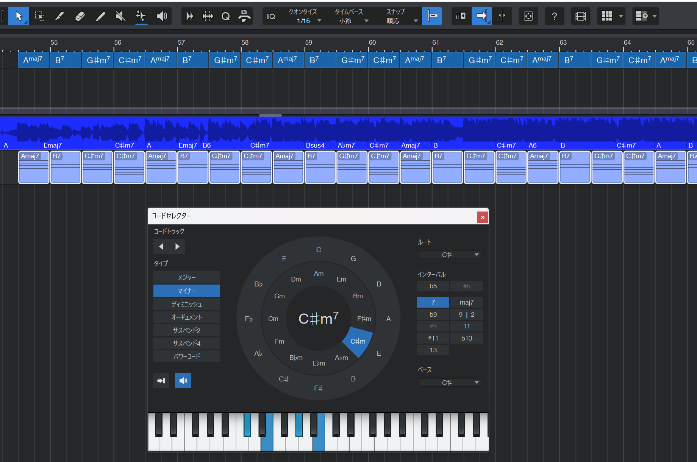

音楽編集に特化した高機能ソフトなだけあって、DAWは極めて優秀なアノテーションツールになり得ます。

例えば自動採譜タスクに使う音符形式のアノテーションであれば、間違いなくうってつけでしょう。DAW内で音符を編集し、MIDIデータを出力するだけです。[Melodyne](https://shop.celemony.com/cgi-bin/WebObjects/CelemonyShop.woa)で仮ラベルを生成できれば、もっと効率良く作業できます。

MIDI以外の形式のアノテーションの場合、標準的なアノテーションフォーマットを直接出力できる訳ではないので、**MIDIデータに出力してから変換する**など、フォーマットの変換作業も織り込んでアノテーション方法を設計する必要があります。

それでも、スナップしたいビートグリッドが備わっているし、コピペはもちろん、ラベルを音で確認することもできるなど、色々メリットがあります。最近のDAWは高度な解析機能が備わっている製品も多く、正確なビートグリッドや仮ラベルを用意することも難しくないので、利用する価値は大いにあるはずです。

一例として、**Presonus Studio One**の機能を駆使し、音楽コード進行アノテーションを作成する手順を紹介します。
1. オーディオトラックに音楽オーディオデータを取り込む
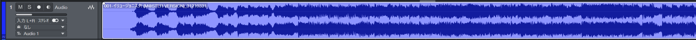
1. オーディオクリップの右クリックメニューから、テンポとビートグリッド検出を行う
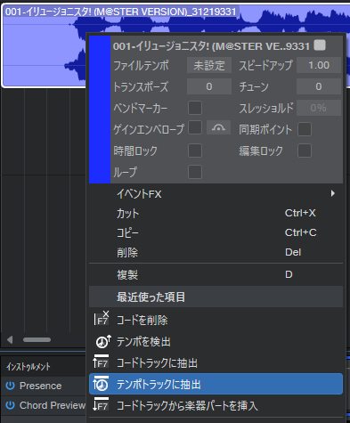
1. オーディオクリップの右クリックメニューから、コード検出を実行し、仮ラベルを生成する
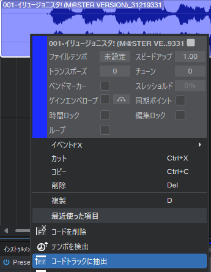
1. 編集機能で、コードラベルを修正する。Studio Oneのコードセレクターはコードの音を鳴らしてくれるので、聞き比べながら選ぶことができます。繰り返しがある場合、既に修正済の部分からコピペすれば効率的です
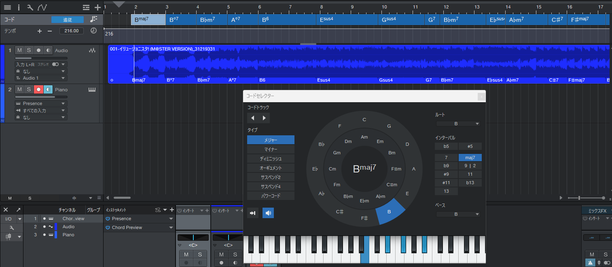
1. コードトラックを全選択し、MIDIトラックにドラッグすると、コードのMIDIノートが生成される。ここでもう一度、通しで音を確認することもできます。
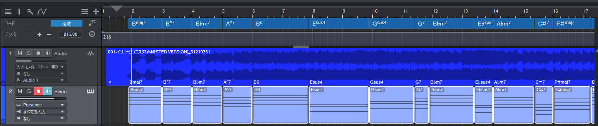
1. MIDIトラックをMIDIファイルに変換する
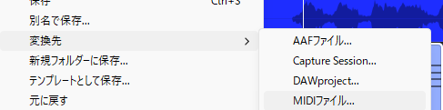
1. MIDIデータからコード名を特定し、アノテーションフォーマットに変換する
